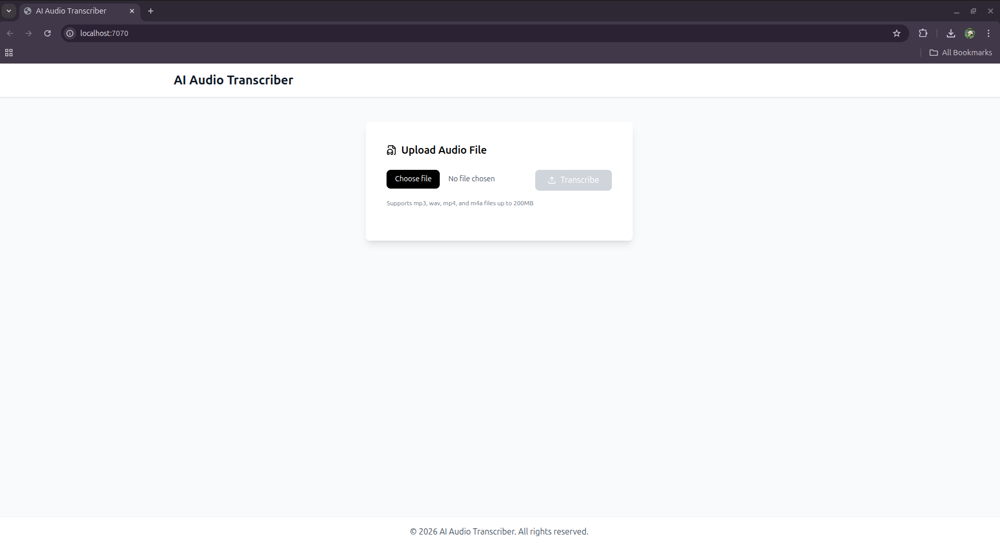
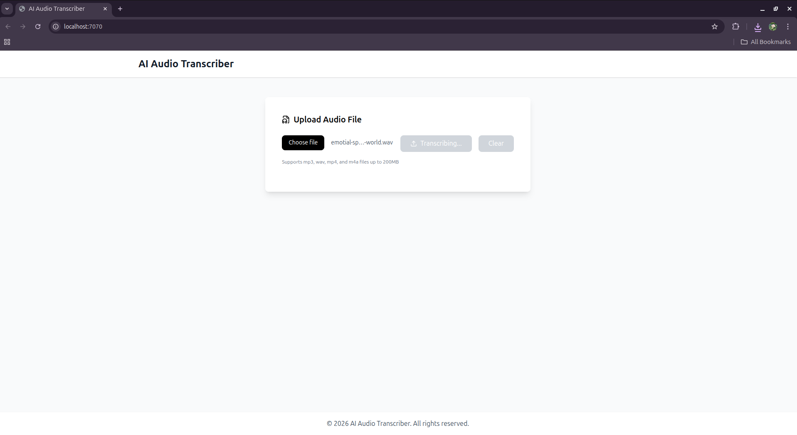
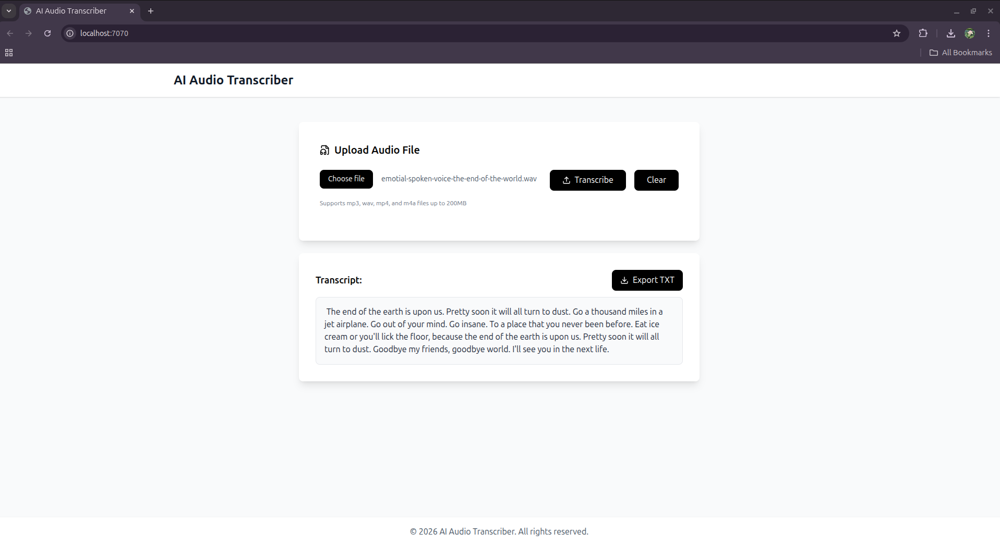
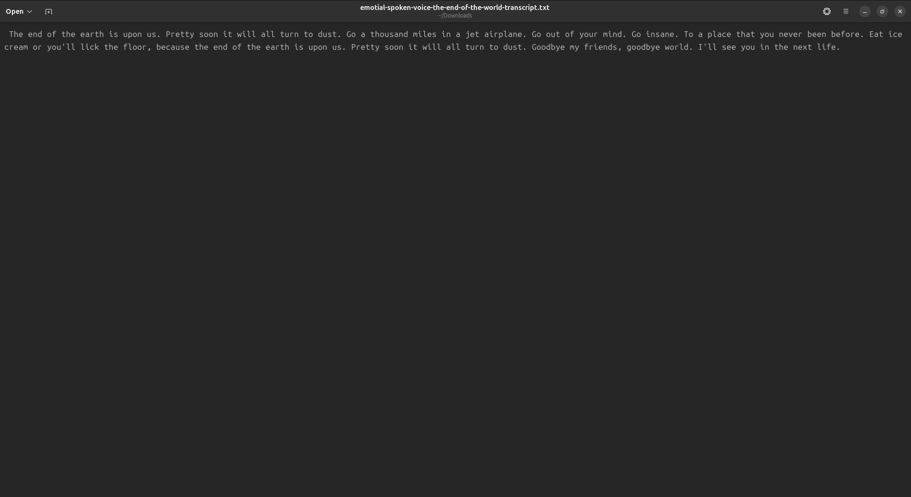
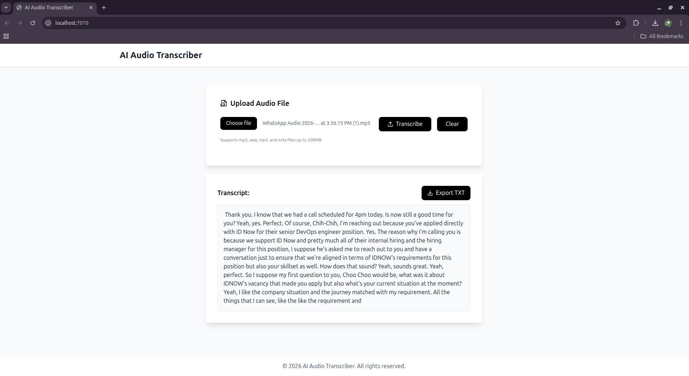
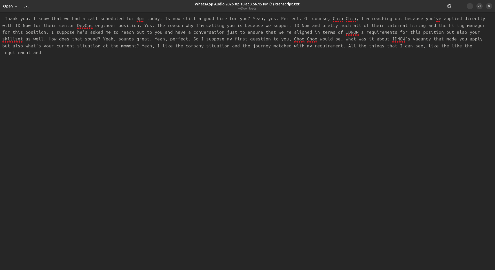
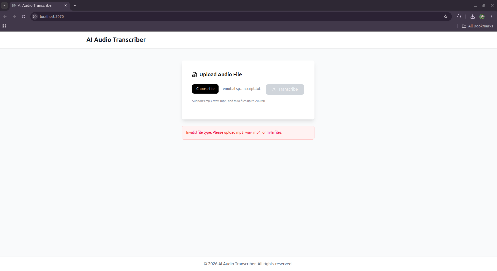

# AI Audio Transcriber

A web application for transcribing audio recordings from offline meetings. Upload your phone recordings and get accurate text transcripts instantly.

## Demo









## Features

- Upload audio files (MP3, WAV, MP4, M4A up to 200MB)
- Automatic transcription using Whisper AI model
- Export transcripts as TXT files
- Clean, responsive black & white interface
- Privacy-focused (local processing, no cloud APIs)
- File validation (type and size)

## Tech Stack

Frontend: React 19, Vite 7, Tailwind CSS 4, Axios, Lucide React  
Backend: Node.js, Express 5, Whisper AI (@xenova/transformers), FFmpeg, Multer

## Project Structure

```
AI-Audio-Transcriber/
├── .dockerignore
├── .gitignore
├── README.md
├── docker-compose.yml
├── screenshots/
├── backend/
│   ├── Dockerfile
│   ├── package.json
│   ├── src/
│   │   ├── server.js
│   │   └── transcribe.js
│   └── uploads/
└── frontend/
    ├── Dockerfile
    ├── index.html
    ├── package.json
    ├── postcss.config.js
    ├── tailwind.config.js
    ├── vite.config.js
    └── src/
        ├── App.jsx
        ├── main.jsx
        ├── index.css
        └── components/
            ├── Home.jsx
            ├── Header.jsx
            └── Footer.jsx
```

## How to Run Locally

Prerequisites:
- Node.js 18+
- FFmpeg installed on system (for local development)
- Docker & Docker Compose (for containerized setup)

### Install FFmpeg

Ubuntu/Debian:
```bash
sudo apt install ffmpeg
```

macOS:
```bash
brew install ffmpeg
```

Windows:
Download from [ffmpeg.org](https://ffmpeg.org/download.html)

### Option 1: Development Mode

1. Clone the repository:
```bash
git clone https://github.com/akhilachiju/AI-Audio-Transcriber.git
cd AI-Audio-Transcriber
```

2. Install and run backend:
```bash
cd backend
npm install
npm run dev
```

3. Install and run frontend (in new terminal):
```bash
cd frontend
npm install
npm run dev
```

Access the application:
- Frontend: http://localhost:7070
- Backend API: http://localhost:7071

### Option 2: Docker

```bash
docker-compose up --build
```

Access the application:
- Frontend: http://localhost:7070
- Backend API: http://localhost:7071

## How to Deploy

### Production Deployment Options

1. Cloud Platform (Recommended)
```bash
cd frontend && npm run build
cd backend && npm install --production
```
Deploy frontend to Vercel/Netlify and backend to Railway/Render

2. VPS/Server
```bash
# Build frontend
cd frontend && npm run build

# Run backend with PM2
cd backend
npm install --production
pm2 start src/server.js
```

Environment Variables:
```bash
PORT=7071
NODE_ENV=production
VITE_API_URL=https://your-api-domain.com
```

## Technical Choices and Decisions

### Frontend: React + Vite
- Fast development with hot reload and modern build tooling
- Tailwind CSS for rapid UI development with black & white theme
- Axios for simple HTTP client
- Lucide React for consistent iconography

### Backend: Node.js + Express
- JavaScript full-stack for consistency
- Multer for file upload handling with validation
- @xenova/transformers for JavaScript Whisper implementation

### Transcription: Local Whisper vs Cloud APIs
Chosen: Local Whisper (@xenova/transformers)

Reasons:
- Privacy: audio files stay local, never sent to external services
- No API costs or usage limits
- No internet dependency after initial model download
- Full control over processing

Trade-offs:
- Higher resource usage (CPU/memory)
- Slower initial model load time
- Limited to whisper-small model for performance

### Audio Processing: FFmpeg
- System FFmpeg for reliable audio format conversion
- Converts audio to optimal format for Whisper (16kHz mono PCM float32)

### AI Models
Available Whisper models (configurable in `backend/src/transcribe.js`):
- `whisper-tiny.en` - 75MB, fastest, English only
- `whisper-base.en` - 150MB, fast, English only
- `whisper-small` - 250MB, balanced (default), multilingual
- `whisper-medium` - 1.5GB, high accuracy, slower, multilingual

## What I Would Improve

### 1. Real-time Progress Tracking
- WebSocket connection to show transcription progress
- Visual progress bar with estimated time remaining
- Better loading states and user feedback

### 2. Enhanced UX
- Drag and drop file upload
- Audio player to preview files before transcription
- Copy to clipboard button for transcripts
- Display selected filename before upload
- Transcript editing with inline corrections
- Word count and character count for transcripts
- Timestamp display in transcripts

### 3. Production Readiness
- Rate limiting to prevent abuse
- Automatic cleanup of uploaded files after processing
- Better error handling and user-friendly error messages
- Health check endpoint for monitoring
- Logging system for debugging

### 4. Testing
- Unit tests for transcription logic
- Integration tests for API endpoints
- E2E tests for upload and download flow
- File validation edge cases

### 5. Performance Optimization
- Queue system for multiple concurrent uploads
- Caching for frequently transcribed content
- Streaming transcription for large files
- Model warm-up on server start

